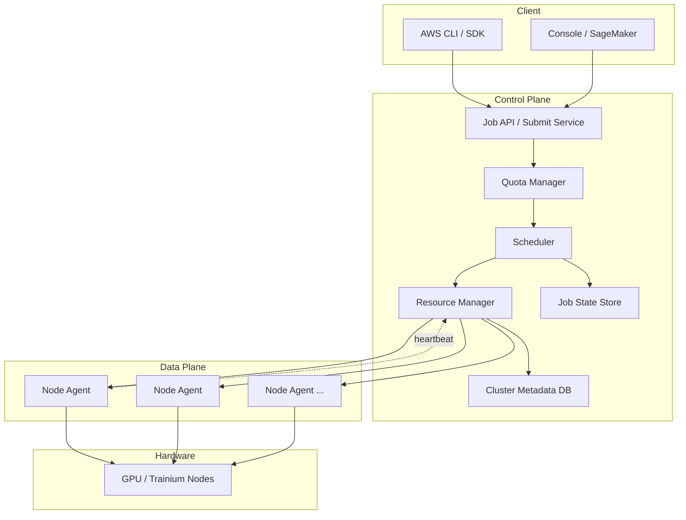
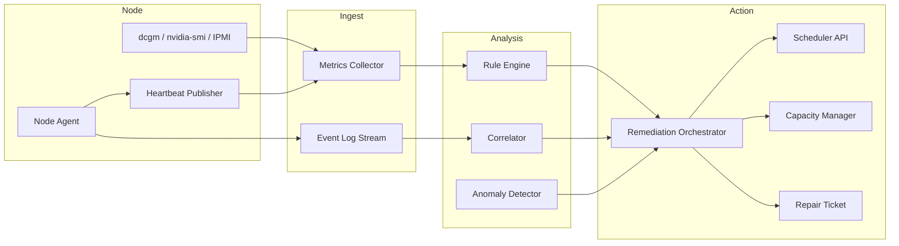
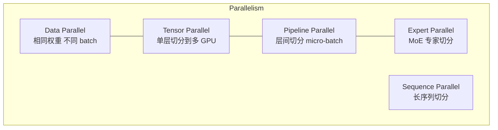
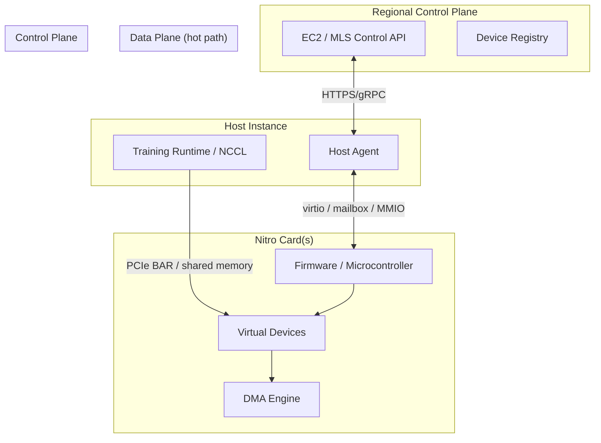
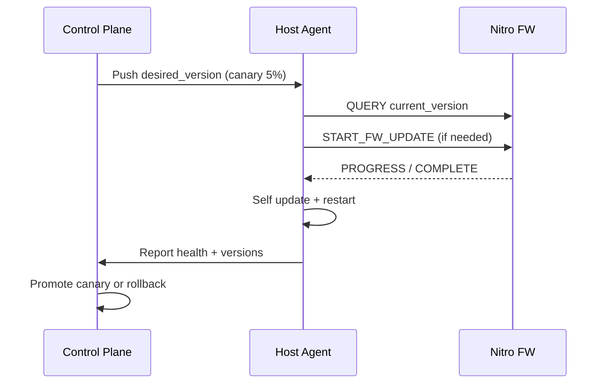
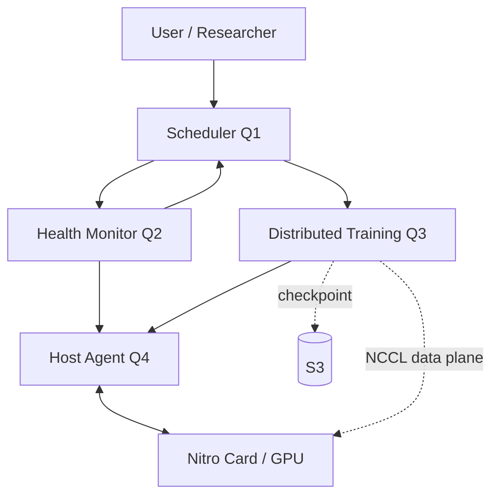

# 17 - AWS EC2 Nitro MLS 系统设计（Senior 岗）

> **面试风格：** 不是 Design Twitter，而是 **大规模 ML 基础设施** — 调度、可靠性、性能、多租户、硬件/固件/Host 协同。  
> **时间分配（45 min）：** 需求澄清 5 min → 高层架构 10 min → 核心组件深挖 20 min → 故障/扩展/权衡 10 min。

---

## 通用答题框架

```
1. Clarify requirements（规模、SLA、租户、workload 类型）
2. High-level architecture（画图：Client → Control Plane → Data Plane → Hardware）
3. Deep dive 2–3 组件（面试官会指定）
4. Trade-offs（一致性 vs 可用性、抢占 vs 公平、同步 vs 异步 checkpoint）
5. Failure modes + monitoring + rollout
```

**Senior 岗必说：**
- 你负责过哪一层？边界在哪？
- 数字：多少节点、多少 job/day、故障恢复时间、checkpoint 大小
- 运维：灰度、回滚、on-call、SLO

---

## Q1：Design an ML Training Cluster Scheduler

**题目：** 设计一个 ML 训练集群调度系统，支持数千用户提交训练 job，在 GPU/Trainium 集群上运行，要求多租户隔离、优先级、故障恢复。

### 1.1 需求澄清（先问面试官）

| 维度 | 典型假设 | 要问的问题 |
|------|----------|------------|
| 规模 | 10k+ nodes，100k jobs/day | 单集群还是多 Region？ |
| Workload | 单机 8×GPU 到 1000+ 节点分布式训练 | 是否支持 inference serving？ |
| 租户 | 多团队/多账号，配额与计费 | 硬隔离还是软隔离？ |
| SLA | 控制面 99.9%，训练 job 尽力交付 | 是否保证 gang scheduling 成功？ |
| 优先级 | 交互式 < 1h 排队；批量可等 24h | 是否支持抢占？ |
| 存储 | 数据集在 S3/FSx，checkpoint 到 S3 | 共享文件系统还是 object store？ |

### 1.2 高层架构



**ASCII 简化版（白板用）：**

```
User → API Gateway → Job Service → Queue(s) → Scheduler → Resource Allocator
                              ↓                        ↓
                         Quota/Billing            Node Agent (per host)
                              ↓                        ↓
                         Audit Log              Container / NCCL / Framework
```

### 1.3 核心组件

#### Job Submission

| 输入 | 处理 |
|------|------|
| Docker image / framework version | 校验镜像在 registry 存在 |
| Resource spec（#GPU, GPU type, #nodes） | 映射到 instance type（p5.48xlarge 等） |
| Dataset / checkpoint URI | 预检 S3 权限、路径可达 |
| Priority class | `interactive` / `standard` / `batch` |
| Gang size | 需要 N 节点同时启动 |

**Job 状态机：**

```
PENDING → QUEUED → ALLOCATING → RUNNING → SUCCEEDED
                ↘                ↘ FAILED / CANCELLED / PREEMPTED
```

#### Queue 设计

| 策略 | 说明 | Trade-off |
|------|------|-----------|
| **多队列** | 按 priority class 分队列 | 简单；高优队列可能饿死低优 |
| **单一队列 + 优先级分数** | score = f(priority, wait_time, quota) | 公平性好；实现复杂 |
| **Fair Share** | 按团队配额分配时间片 | 多租户公平；大 job 可能碎片化 |

**推荐：** 多队列 + 队列内 Fair Share + aging（等待越久优先级微升，防饿死）。

#### Resource Allocation（关键难点）

**Gang Scheduling：** 分布式训练要求 N 个节点**同时**可用，否则 NCCL 初始化失败。

```
Scheduler 收到 job（需要 64 nodes × 8 GPU）:
  1. 查询 Resource Manager：哪些 rack/AZ 有连续容量？
  2. 拓扑感知：优先同一 spine switch / 同一 AZ（降低 NCCL 延迟）
  3. 预留（soft reservation）→ 通知 Node Agent 预热 → 全部 ready 后 atomically 启动
  4. 超时未凑齐 → 释放预留，重新排队或降级
```

| Trade-off | 选项 A | 选项 B |
|-----------|--------|--------|
| 碎片整理 | 等待合并碎片（延迟↑，利用率↑） | 立即分配部分节点（可能 gang 失败） |
| 拓扑 | 严格同 rack（性能↑，调度难） | 跨 rack（易调度，AllReduce 慢） |
| 抢占 | 低优 job 可被踢（高优 SLA↑） | 不抢占（简单，高优可能等很久） |

#### 多租户隔离

| 层级 | 机制 |
|------|------|
| **网络** | VPC / Security Group；训练流量走 RDMA 专用网 |
| **计算** | cgroups / container；GPU MIG（推理）或整卡（训练） |
| **存储** | IAM role per job；S3 prefix 隔离 |
| **配额** | GPU-hours / max concurrent jobs per account |
| ** noisy neighbor** | 网络 QoS；禁止跨租户 GPU P2P |

#### Fault Recovery

| 故障 | 检测 | 恢复 |
|------|------|------|
| 单节点 crash | Agent heartbeat 丢失 | 若 job 支持容错：替换节点 + 从 checkpoint 恢复 |
| 网络分区 | NCCL timeout | 标记 job FAILED 或 retry with new allocation |
| OOM | CUDA OOM / exit code | 可选自动降 batch size 重试（需用户配置） |
| 部分节点慢（straggler） | step time p99 | 弹性训练框架（PyTorch Elastic）踢慢节点 |

**Checkpoint 策略（与 Q3 联动）：**
- 默认每 N 分钟 / 每 K steps 异步写 S3
- 节点失败 → Scheduler 用**同一 checkpoint** 在新 allocation 上重启

### 1.4 数据模型（简化）

```
Job {
  job_id, user_id, priority, state, gang_size,
  instance_type, image, env, checkpoint_uri,
  created_at, started_at, allocation_id
}

Allocation {
  allocation_id, job_id, node_ids[], state,
  reserved_at, expires_at
}

Node {
  node_id, instance_type, gpu_count, state,
  rack_id, az, agent_version, last_heartbeat
}
```

### 1.5 监控与 SLO

| 指标 | 目标 |
|------|------|
| Queue wait time p50/p99 | 按 priority class 分报 |
| Scheduling success rate | gang job 一次分配成功率 |
| GPU utilization | 集群级 > 85% |
| Job failure rate | 区分 user error vs platform error |
| Time to recovery | 节点故障 → job 恢复 < X min |

### 1.6 45 min 口述提纲

1. **0–5 min：** 澄清 gang scheduling、多租户、是否抢占  
2. **5–15 min：** 画 Control Plane vs Data Plane；Job → Queue → Scheduler → Agent  
3. **15–30 min：** 深挖 gang scheduling + 拓扑感知 + checkpoint 恢复  
4. **30–40 min：** 多租户配额、抢占 trade-off、队列饿死  
5. **40–45 min：** 监控、灰度发布新 scheduler 版本、问你还有什么问题  

### 1.7 面试官可能追问

- 如何避免 scheduler 单点？→ 主从 + 分布式锁（DynamoDB/etcd）；分片按 cluster  
- 10x job 提交高峰？→ API 限流 + 队列背压 + 异步 submit  
- 用户指定 spot / on-demand？→ 双队列 + spot 被回收时 checkpoint 迁移  

---

## Q2：Design GPU Node Health Monitoring & Self-Healing

**题目：** 集群有数万 GPU 节点，如何监控健康、检测硬件故障、自动 drain 问题节点并替换？

### 2.1 需求澄清

| 维度 | 典型假设 |
|------|----------|
| 故障类型 | GPU ECC、Xid error、NVLink 降级、磁盘/NIC 故障、Agent 无响应 |
| 检测延迟 | 关键错误 < 1 min；慢退化 < 5 min |
| 自愈动作 | drain → 终止其上 job → 标记不可调度 → 触发替换/维修 |
| 误报代价 | 误 drain 会杀掉长训练 → 要高置信度 + 渐进式 |

### 2.2 架构



### 2.3 健康信号分层

| 层级 | 信号 | 频率 | 动作 |
|------|------|------|------|
| **Liveness** | Agent heartbeat | 10–30s | 3 次 miss → suspect |
| **GPU 驱动** | Xid error, CUDA illegal access | 事件驱动 | 立即标记 unhealthy |
| **GPU 硬件** | ECC correctable / uncorrectable | 1 min | uncorrectable → drain |
| **互连** | NVLink/NVSwitch 降速、RDMA 错误 | 1 min | 分布式训练节点 → drain |
| **系统** | CPU temp, disk SMART, OOM | 1–5 min | 累积阈值 |
| **Workload** | NCCL timeout, step hang | job 级 | 可能节点或网络问题 |

**DCGM 关键字段（面试可提）：**
- `ecc_errors.corrected` / `uncorrectable`
- `nvlink_crc_errors`
- `gpu_utilization`, `memory_temperature`
- Xid 错误码（如 48, 63, 79 等）

### 2.4 节点状态机

```
HEALTHY → SUSPECT → DRAINING → UNHEALTHY → REPAIRING → HEALTHY
              ↘ RECOVERED（误报回滚）
```

| 状态 | 行为 |
|------|------|
| **SUSPECT** | 仍接受新 job；加重监控频率 |
| **DRAINING** | 不分配新 job；等待现有 job 结束或 checkpoint 后终止 |
| **UNHEALTHY** | 不可调度；触发替换流程 |
| **REPAIRING** | 裸机维修 / 固件升级 / 重装 Agent |

### 2.5 自愈流程（端到端）

```
1. Rule Engine: ECC uncorrectable on GPU3
2. Correlator: 同一节点 5 min 内 3 次相关事件 → confidence HIGH
3. Orchestrator:
   a. 调用 Scheduler API: set_node_state(DRAINING)
   b. 通知 Node Agent: 停止接受新 workload
   c. 对 RUNNING jobs: 发 SIGTERM → 等待 checkpoint（timeout 10 min）
   d. 强制 kill 超时 job
   e. 节点 → UNHEALTHY
   f. Capacity Manager: 申请替换实例（同 AZ/rack 优先）
   g. 创建维修 ticket（机架位置、错误日志、SN）
4. 新节点加入 → 跑 smoke test（GPU burn-in 5 min）→ HEALTHY
```

### 2.6 Trade-offs

| 决策 | 激进 | 保守 |
|------|------|------|
| Drain 速度 | 立即 kill job（平台可靠↑，用户伤害大） | 等 checkpoint（用户友好，坏节点占资源） |
| 误报 | 少 drain，多人工 | 多自动 drain，依赖 smoke test 恢复 |
| 关联 | 单信号即 action | 多信号投票（降误报，延迟↑） |
| GPU 部分故障 | MIG 屏蔽单 GPU | 整节点 drain（简单） |

**推荐：** 硬错误（uncorrectable ECC、Xid）立即 drain；软信号（correctable ECC 增多）先 SUSPECT + 加速监控。

### 2.7 与训练调度联动

- Scheduler **allocation 时过滤** UNHEALTHY / DRAINING 节点  
- Job 失败原因标注 `PLATFORM_NODE_FAILURE` → 自动免费重试（不占用户配额）  
- 维修中的 rack **临时降低** 该区域 gang scheduling 权重  

### 2.8 45 min 口述提纲

1. 分层信号：heartbeat → 驱动事件 → 硬件 ECC → workload 异常  
2. 状态机 + drain 流程（强调 checkpoint 友好终止）  
3. 误报处理：SUSPECT、关联器、回滚  
4. 与 Scheduler、Capacity、维修工单集成  
5. 监控 dashboard：MTTR、误报率、每 rack 故障率  

---

## Q3：Design Large Model Distributed Training Pipeline

**题目：** 设计支持千亿参数大模型训练的分布式 pipeline，涵盖并行策略、通信、checkpoint 与断点续训。

### 3.1 需求澄清

| 维度 | 典型假设 |
|------|----------|
| 模型规模 | 7B–400B+ 参数 |
| 集群 | 数百～数千 GPU（H100 / Trainium） |
| 框架 | PyTorch FSDP / Megatron-LM / DeepSpeed |
| 存储 | 数据集 S3；checkpoint 数百 GB～TB |
| 故障 | 期望每 few hours 有节点失败 |

### 3.2 并行策略总览



| 策略 | 切什么 | 通信模式 | 何时用 |
|------|--------|----------|--------|
| **Data Parallel (DP)** | batch | AllReduce 梯度 | 模型放得下单卡 |
| **Tensor Parallel (TP)** | 权重矩阵列/行 | AllReduce / AllGather 每层 | 单层太大 |
| **Pipeline Parallel (PP)** | 层段 | P2P activations | 层数多、需跨卡 |
| **FSDP / ZeRO** | 优化器状态分片 | ReduceScatter + AllGather | 省显存 |
| **Expert Parallel (EP)** | MoE 专家 | All-to-All token | Mixtral 类模型 |

**组合示例（175B 类）：**
- TP=8 within node, PP=4 across nodes, DP=剩余 → 需要 8×4×DP 张卡  
- 3D Parallelism：DP + TP + PP 同时启用  

### 3.3 训练 Pipeline 架构

```
┌─────────────────────────────────────────────────────────────┐
│  Control Plane                                               │
│  Job Launcher → Topology Config → Elastic Controller         │
└─────────────────────────────────────────────────────────────┘
                              ↓
┌─────────────────────────────────────────────────────────────┐
│  Training Workers (per rank)                                 │
│  Data Loader → Forward → Backward → Optimizer Step           │
│       ↓              ↓                                        │
│   S3/FSx         NCCL (AllReduce / P2P / All-to-All)         │
└─────────────────────────────────────────────────────────────┘
                              ↓
┌─────────────────────────────────────────────────────────────┐
│  Checkpoint Service (async)                                │
│  Rank0 coordinator → sharded state dict → S3 multipart       │
└─────────────────────────────────────────────────────────────┘
```

### 3.4 通信与拓扑

| 要点 | 说明 |
|------|------|
| **NCCL** | 自动选 Ring / Tree AllReduce；NVLink 内 node 快，跨 node 走 IB/RoCE |
| **拓扑感知** | 同 job 的 ranks 映射到物理邻近 GPU（NCCL `CUDA_VISIBLE_DEVICES` + rank file） |
| **梯度累积** | 小 batch 模拟大 batch；减通信频率 |
| **重叠** | backward 与 AllReduce overlap（bucket 分片） |

**带宽粗算（面试加分）：**
- 7B FP16 模型 ≈ 14 GB 权重；optimizer FP32 状态 ≈ 28 GB → ZeRO-3 可分片  
- 每 step AllReduce 量 ≈ 梯度大小（与模型大小同量级，分片后 per-GPU 更小）  

### 3.5 Checkpoint 设计

#### 内容

```
checkpoint/
  metadata.json      # step, epoch, parallel config, framework version
  model/             # sharded weights (per rank or consolidated)
  optimizer/         # sharded optimizer states
  rng_states/        # reproducibility
  dataloader/        # epoch offset, shard position
```

#### 同步 vs 异步

| 方式 | 优点 | 缺点 |
|------|------|------|
| **同步 checkpoint** | 一致性强 | 训练暂停 5–30 min（大模型） |
| **异步 checkpoint** | 几乎不暂停 | 可能丢最近 N steps；实现复杂 |

**推荐：** 异步 + 周期性同步 barrier checkpoint（如每 4h 做一次一致点）。

#### S3 写入优化

- **分片并行写**：每个 rank 写自己的 shard → `s3://bucket/job/step/rank_{i}.pt`  
- **Multipart upload**：>100 MB 分 part  
- **增量 checkpoint**：只写 changed shards（optimizer 步后）  
- **压缩**：FP16/BF16；可选 zstd  

### 3.6 断点续训（Elastic / Fault Tolerant）

```
1. Node failure detected（Q2 联动）
2. Elastic Controller 收到 membership change
3. 选项 A: 缩小 world size 继续（需框架支持）
4. 选项 B（更常见）: 从 last successful checkpoint 重启
   - Scheduler 新 allocation（同 gang 拓扑尽量一致）
   - 下载 checkpoint shards 到本地 NVMe（并行）
   - 校验 metadata.parallel_config 匹配
   - 恢复 dataloader offset → 继续 step N
5. 记录 job_attempt_id，避免重复计费
```

**关键：** `parallel_config`（TP/PP/DP rank 映射）变化时需 **reshard checkpoint**（Megatron 提供转换工具）。

### 3.7 Trade-offs 汇总

| 决策 | 偏性能 | 偏可靠/简单 |
|------|--------|-------------|
| 并行 | 高 TP 减通信跨 node | 高 DP 实现简单 |
| Checkpoint 频率 | 每 15 min（恢复快） | 每 2h（存储省、开销小） |
| 存储 | 本地 NVMe 缓存 + 异步刷 S3 | 直接写 S3（慢） |
| 容错 | 热 standby 节点 | checkpoint 冷启动 |

### 3.8 45 min 口述提纲

1. 澄清模型大小、框架、故障期望  
2. 讲清 DP / TP / PP / FSDP 适用场景（画 3D 并行图）  
3. NCCL + 拓扑感知  
4. Checkpoint 分片、异步写 S3、断点续训流程  
5. 与 Scheduler（Q1）、Health（Q2）如何联动  

---

## Q4：Design Host Agent ↔ Nitro Card Communication

**题目：** EC2 实例中 Host CPU 上的 Agent 如何与 Nitro 卡（专用硬件 offload）通信？强调 control plane vs data plane、可靠性、版本升级。

> **背景（公开信息）：** Nitro 将网络、存储、安全管理等从 Host 卸载到专用 Nitro Cards；MLS 团队做 ML 超算平台，Host Agent 可能管理加速器、固件、健康上报等。

### 4.1 需求澄清

| 维度 | 典型假设 |
|------|----------|
| Nitro 职责 | 网络虚拟化、EBS、本地 NVMe、（ML 场景）加速器管理/offload |
| Host Agent 职责 | 训练 runtime、健康采集、配置下发、与 Regional Control Plane 通信 |
| 可靠性 | 控制命令 at-least-once；数据面尽量不经过 Agent |
| 升级 | Host OS、Agent、Nitro 固件独立版本；需协调 |

### 4.2 Control Plane vs Data Plane



| 平面 | 流量 | 路径 | 延迟要求 |
|------|------|------|----------|
| **Data Plane** | 训练 tensor、NVMe I/O、RDMA | Host ↔ Nitro ↔ Device，**绕过 Agent** | μs 级 |
| **Control Plane** | 配置、固件版本、健康、reset | Host Agent ↔ Nitro FW ↔ Regional API | ms–s 级 |

**面试金句：** Agent 不做 data path 转发；只做 **配置、观测、生命周期**。

### 4.3 通信机制（概念层）

| 机制 | 用途 | 说明 |
|------|------|------|
| **PCIe MMIO** | 寄存器读写 | 配置 BAR、中断掩码 |
| **Doorbell / Mailbox** | 命令/响应 | Host 写 command queue，Nitro FW 轮询或中断 |
| **Shared memory ring** | 批量状态上报 | 类似 virtio queue；SPSC（见手撕题） |
| **MSI-X interrupt** | 事件通知 | ECC error、command complete |
| **virtio 设备** | 标准化 I/O | 网络、块设备已有成熟模型 |

**命令示例：**

```
Host Agent → Nitro:
  GET_HEALTH
  SET_POWER_CAP { watts }
  RESET_DEVICE { gpu_id }
  GET_FIRMWARE_VERSION

Nitro → Host Agent (async events):
  GPU_ECC_ERROR { gpu_id, type }
  THERMAL_WARNING
  COMMAND_COMPLETE { cmd_id, status }
```

### 4.4 可靠性设计

| 问题 | 方案 |
|------|------|
| 命令丢失 | 每个 command 带 `cmd_id` + ACK；超时重试（幂等命令） |
| Agent crash | Nitro FW 保持 last known config；Regional CP 检测 heartbeat 并重发 config |
| Nitro FW hang | Watchdog；Host 侧 PCIe error → 触发 card reset（需迁移 workload） |
| 版本不兼容 | 握手阶段交换 `API_VERSION`；拒绝不兼容组合 |
| 分裂脑 | 以 Regional CP 为 source of truth；Agent 定期全量 sync |

**幂等命令设计：**
- `GET_*` 天然幂等  
- `RESET` 带 `reset_generation` 避免重复 reset 混乱  
- `SET_CONFIG` 带 `config_version` 单调递增  

### 4.5 版本升级（协调三件套）

```
Component          Upgrade order (typical)
─────────────────────────────────────────
Nitro Firmware     1. 先 canary 一批 rack
Host Agent         2. 与 FW API 版本协商后滚动
Host OS / Driver   3. 最后或维护窗口

Rollback: 保留 N-1 FW + Agent；health check 失败自动回滚
```

**滚动策略：**



| 阶段 | 检查 |
|------|------|
| Pre-flight | 磁盘空间、API 兼容矩阵、无 RUNNING critical job |
| Canary | 5% rack 24h；GPU burn-in + 真实 job shadow |
| Rollout | 分批 10%；每批观察 error rate |
| Post | 全量版本对账；维修未升级节点 |

### 4.6 安全

- Host Agent **最小权限**：只打开需要的 Nitro mailbox 区域  
- 命令 **签名** 或 TLS 到 Regional CP 鉴权后再下发  
- 敏感操作（firmware update）需 **二次确认** + audit log  

### 4.7 45 min 口述提纲

1. 分清 data plane（训练/I/O 直连）vs control plane（Agent 配置）  
2. Mailbox + 共享内存 + 中断的事件驱动模型  
3. 命令幂等、超时重试、版本握手  
4. FW / Agent / Driver 滚动升级与回滚  
5. 与 Q2 健康监控：Nitro 上报 ECC → Agent → Regional  

### 4.8 诚实边界（面试加分）

> 「我没有 Nitro 内部实现细节，但我会按 **硬件 offload 平台通用模式** 设计：data plane 旁路 Agent，control plane 用版本化命令 + 可观测 + 可回滚升级。」

---

## 四题联动（一张总图）



**一句话串讲：**  
用户经 Scheduler 提交 gang job → Resource Manager 选健康节点 → Host Agent 配置 Nitro/加速器 → 训练 runtime 走 data plane → 异步 checkpoint 到 S3 → Health Monitor 发现 ECC → drain 节点 → Scheduler 从 checkpoint 重新分配。

---

## 模拟面试 Checklist

| 检查项 | ✓ |
|--------|---|
| 先问规模、SLA、租户、workload | |
| 画了 Control / Data plane | |
| 讲了至少 2 个 trade-off | |
| 有故障场景 + 恢复路径 | |
| 有监控指标和数字 | |
| 提到灰度 / 回滚 | |
| 45 min 内留时间给面试官提问 | |

---

## 推荐延伸阅读（公开资料）

- AWS Nitro System [官方博客](https://aws.amazon.com/ec2/nitro/)
- PyTorch Distributed / FSDP 文档
- NCCL 拓扑与性能调优
- Megatron-LM 3D parallelism 论文
- Google Borg / Omega 调度器（学术参考）
- Kubernetes gang scheduling（Volcano / KubeBatch）

---

## 与仓库其他材料的关系

| 材料 | 关联 |
|------|------|
| [interview_handwrite/cpp/](../interview_handwrite/cpp/) | SPSC ring buffer ↔ Host↔Nitro mailbox |
| [nvidia/01-系统设计.md](../nvidia/01-系统设计.md) | GPU scheduler 思路可对比 Q1 |
| [04-手撕代码指南.md](./04-手撕代码指南.md) | 并发 DS 支撑 Q4 通信层 |
