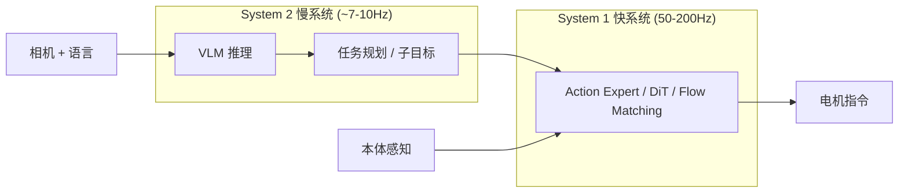

# 18 - 具身智能大模型进展与面试准备

> 面向具身智能 / 机器人基础模型 / VLA 相关岗位（2025–2026 视角）。  
> 你的背景（Google、C++、Camera/AI Infra）可重点强调：**数据管线、端侧推理、系统栈、多模态感知**。

---

## 一、领域全景：从「流水线」到「统一大脑」

### 1.1 三代范式演进

```
Gen 1 (2020–2022)          Gen 2 (2023–2024)              Gen 3 (2025–2026)
─────────────────          ─────────────────              ─────────────────
Perception → Plan → Act    VLA 端到端                      VLA + 双系统 + World Model
模块化、硬编码              RT-2, OpenVLA, Octo            π0, GR00T, Helix, Qwen-VLA
```

| 范式 | 代表 | 输入 → 输出 | 2026 地位 |
|------|------|-------------|-----------|
| **模块化** | RT-1, SayCan | 图像+语言 → 离散技能 ID | 研究/遗留系统 |
| **VLA 端到端** | RT-2, OpenVLA, π0 | 图像+语言+状态 → 动作 | **主流** |
| **双系统 VLA** | Helix, GR00T N1.6, π0.7 | 慢推理 + 快控制 | **头部量产方向** |
| **Embodied VLM** | Embodied-R1.5, Gemini Robotics | 物理推理 → 再接动作头 | **新趋势** |
| **World Model** | Cosmos, V-JEPA 2, Genesis | 预测未来状态/帧 | **数据生成 + 规划** |

### 1.2 核心定义

**VLA（Vision-Language-Action）**：在预训练 VLM 上接动作头，把「看懂、听懂」直接映射为「怎么做」。

```
RGB/Depth + Proprioception + Language Instruction
                    ↓
            VLM Backbone (Qwen, Llama, Gemini, PaLI...)
                    ↓
            Action Head (Diffusion / Flow Matching / Token AR)
                    ↓
        Continuous actions (Δjoint, EE pose, gripper) 或离散 token
```

---

## 二、技术架构：2026 年共识

### 2.1 双系统（System 2 + System 1）

几乎所有头部人形/操作模型都采用类似结构：



| 系统 | 职责 | 典型实现 | 频率 |
|------|------|----------|------|
| **System 2** | 语义理解、长程规划、子目标分解 | 大 VLM（7B–70B+） | 5–10 Hz |
| **System 1** | 连续控制、接触 rich 操作、全身协调 | DiT / Flow Matching / 小 Transformer | 50–200 Hz |

**面试金句：** Diffusion Policy 没有「死」，它退化成 VLA 的 **action head**。

### 2.2 动作表示的四种路线

| 路线 | 代表 | 优点 | 缺点 |
|------|------|------|------|
| **离散 Token** | RT-2, OpenVLA, π0-FAST | 复用 LLM 词表、训练简单 | 量化误差、高频控制难 |
| **连续回归** | 早期 RT-1 | 简单 | 多模态分布建模差 |
| **Diffusion / Flow Matching** | π0, GR00T, CogACT | 表达多峰分布、精细操作 | 推理慢、需多步 denoise |
| **FAST (DCT tokenization)** | π0-FAST | 自回归 + 高效动作压缩 | 较新，生态在成长 |

### 2.3 训练 Pipeline（工业界标准四阶段）

```
Stage 0: Web-scale VLM 预训练（互联网图文）
    ↓
Stage 1: 机器人数据预训练（Open X-Embodiment, AgiBot, DROID 等）
    ↓
Stage 2: 本体/场景微调（post-training on target robot）
    ↓
Stage 3: RL / 人类反馈 / 仿真对齐（可选，长程任务关键）
```

**新趋势（Embodied-R1.5, Qwen-VLA）：** 先在 **Embodied VLM** 阶段内化物理推理，再用**少量动作数据**接 VLA head，降低对大规模 action pretraining 的依赖。

---

## 三、国际重点模型图谱

### 3.1 第一梯队

| 模型/公司 | 参数量 | 架构 | 核心亮点 | 商业化 |
|-----------|--------|------|----------|--------|
| **π0 / π0.5 / π0.7** (Physical Intelligence) | ~3–5B | Flow Matching VLA + MEM 记忆 | 灵巧操作、多模态 context 提示、长程任务 | 企业试点，LeRobot 开源权重 |
| **GR00T N1/N1.6/N1.7** (NVIDIA) | 多尺度 | VLM + Diffusion Transformer | 跨本体、Cosmos 合成数据、Isaac 生态 | 开放参考平台，OEM 集成 |
| **Helix** (Figure AI) | 未公开 | 端到端 VLA 双系统 | 全身人形、200Hz 快系统、工业 8h 连续 | BMW 产线等 |
| **Gemini Robotics** (Google DeepMind) | 未公开 | 多模态 VLA | 空间推理、与 Gemini 统一 | 合作伙伴集成 |
| **RT-2X** (Google, 历史) | 55B | PaLI-X + 离散动作 token | 证明 VLM→动作可行 | Everyday Robots 已关停 |
| **OpenVLA / OpenVLA-OFT** (Stanford/Berkeley) | 7B | Prismatic VLM + 离散 token | **开源标杆**，LoRA 微调友好 | 研究/创业广泛使用 |
| **Qwen-VLA** (阿里) | 4B+ | Qwen3.5 + DiT flow-matching head | 操作+导航+第一人称统一动作空间 | 2026 新发布 |
| **Embodied-R1.5** | 8B | Embodied Foundation Model → VLA | 24 个 benchmark SOTA，少 action data | 研究 |

### 3.2 π 系列演进（必背时间线）

| 版本 | 关键创新 |
|------|----------|
| **π0** | 首个大规模 Flow Matching VLA，跨本体操作 |
| **π0-FAST** | DCT 动作 tokenization，自回归，训练快 5× |
| **π0.5** | 未见环境 zero-shot、更强泛化 |
| **π0.6** | MEM 记忆系统 |
| **π0.7** | 四维多模态 context（语言+子目标图+元数据+本体），可 steer |

### 3.3 NVIDIA 生态（平台派）

```
Cosmos (World Model 生成合成视频/物理数据)
    ↓
Isaac Sim / Isaac Lab (仿真 + 域随机化)
    ↓
GR00T Foundation Model (跨本体 VLA)
    ↓
Jetson Thor (端侧推理)
```

**定位：** 不做整机，做「机器人界的 Android」——卖芯片 + 仿真 + 基础模型 + 工具链。

### 3.4 其他重要工作

| 模型 | 特点 |
|------|------|
| **Octo** | 开源通用策略，Transformer，易微调 |
| **RDT / RDT-2** (清华) | 扩散 Transformer 人形操作 |
| **CogACT** | VLM + DiT action head |
| **InternVLA-M1** | 空间 grounding → 动作生成 |
| **UniVLA** | 统一自回归 VLA + world modeling |
| **Green-VLA** | 分阶段训练 + 多本体 + RL 精调 |
| **X-VLA** | 跨本体 flow matching |

---

## 四、国内进展（2025–2026）

### 4.1 两条路线

```
路线 A：硬件本体 + 规模出货          路线 B：具身大脑 + 软硬件解耦
─────────────────────────          ─────────────────────────
宇树、智元、优必选、众擎              银河通用、千寻智能、星海图
卖机器人、赚硬件毛利                  卖模型/方案、赚数据与算法壁垒
```

### 4.2 重点公司

| 公司 | 定位 | 模型/技术 | 2025–2026 进展 |
|------|------|-----------|----------------|
| **宇树 (Unitree)** | 人形/四足硬件龙头 | 本体控制为主，GR00T 合作 | 人形出货 5500+ 台，拟 IPO |
| **智元 (Agibot)** | 工业具身 | GO-1 等 VLA | 第 10000 台下线（2026.3） |
| **银河通用 (Galbot)** | 具身大脑 | **AstraBrain** 端到端大模型 | 估值 200 亿+，宁德时代产线试点 |
| **千寻智能** | 具身基座模型 | **Spirit v1.6** (VLA+World Model) | RoboArena 评测称全球第一（媒体报道） |
| **星海图** | 世界模型 + 开发者平台 | CALABAS | 世界模型方向，估值 200 亿+ |
| **星动纪元** | 灵巧手 + 人形 | 端到端操作 | 灵巧手出海 50% |
| **优必选** | 人形商用 | 自有栈 + 生态合作 | 订单 ~14 亿元级（报道） |

### 4.3 国内技术叙事差异

- **银河通用 AstraBrain**：强调「大脑-小脑-神经控制」统一端到端 + 百亿级仿真/真实数据（AstraSynth）
- **千寻 Spirit**：VLA + World Model 融合，强调百万小时真实交互数据
- **智元 GO-1**：AgiBot 海量真机数据 + 通用 VLA

---

## 五、数据与 World Model

### 5.1 数据来源矩阵

| 来源 | 规模 | 优点 | 缺点 |
|------|------|------|------|
| **真机遥操作** | Open X-Embodiment ~1M episodes | 真实物理 | 贵、慢、分布窄 |
| **仿真 (Isaac/MuJoCo/ManiSkill)** | 近乎无限 | 便宜、可域随机化 | Sim2Real gap |
| **World Model 合成** | Cosmos, V-JEPA, Genesis | 场景多样性 | 物理保真度 |
| **人类视频 (egocentric)** | Ego4D, 大量 YouTube | 规模大 | 无动作标签，需逆动力学 |
| **互联网图文** | 数十亿 | 语义/物体知识 | 无物理接地 |

### 5.2 2026 共识

> **数据是具身智能的「石油」**，但单一数据源不够；头部玩家都在做 **混合数据配方（data recipe）**。

关键工程问题：
- 动作空间归一化（不同机器人 joint limit 不同）
- 跨本体对齐（embodiment-specific adapter / unified action space）
- 数据质量 > 数据数量（混合质量数据 + 元数据标注，π0.7 核心思路）

---

## 六、评测 Benchmark（面试常问）

| Benchmark | 测什么 | 特点 |
|-----------|--------|------|
| **LIBERO** | 操作泛化（spatial/object/goal/long） | 最常用，~90%+ 已卷到顶 |
| **SimplerEnv** | 视觉匹配 sim2real | Google Robot 设定 |
| **CALVIN** | 长程语言条件操作链 | 多步指令 |
| **BEHAVIOR-1K** | 1000 家庭活动 | 长程、复杂 |
| **RoboCasa / RoboTwin** | 厨房/双臂 | 仿真 |
| **RoboArena** | 综合竞技评测 | 千寻 Spirit 报道第一 |
| **VLA-Arena / vla-eval** | 统一评测框架 | Ai2 2026 开源，18+ benchmark |

**面试要点：** 高分不等于能商用——benchmark 是 sim、单任务、短 horizon；真机长尾故障、接触力、校准误差才是落地难点。

---

## 七、工程栈（从 ALOHA 到 VLA 部署）

```
1. 数据采集      ROS2 / LeRobot / 自研遥操作
2. 数据格式      RLDS / LeRobot Dataset v2 / HDF5
3. 训练          PyTorch + FSDP / DeepSpeed + 多机 GPU
4. 仿真验证      Isaac Sim / MuJoCo
5. 模型服务      TensorRT / ONNX / 量化 INT8/FP8
6. 端侧推理      Jetson Thor / Orin / 自研 NPU
7. 真机闭环      50-200Hz 控制环 + 安全监控
```

### 与你背景的映射

| 你的经验 | 具身智能对应 |
|----------|-------------|
| Camera/ISP | 多相机同步、HDR、畸变、手眼标定 |
| 端侧部署 | VLA 端侧量化、action head 剪枝、TensorRT |
| AI Infra | 训练集群调度、数据管线、checkpoint |
| C++ 系统 | 实时控制环、ROS2 node、零拷贝传感 |
| 视觉算法 | 深度估计、物体检测、场景理解 → VLM 前置 |

---

## 八、当前瓶颈与开放问题（高级岗必谈）

| 问题 | 现状 | 可能方向 |
|------|------|----------|
| **长程任务可靠性** | 10+ 步成功率骤降 | 分层规划、记忆、RL 精调 |
| **接触 rich 操作** | 叠衣服、插孔仍难 | 触觉融合、力控、更多接触数据 |
| **跨本体迁移** | 换机器人需大量微调 | Unified action space、adapter |
| **Sim2Real** | 仿真高分、真机打折 | 域随机化、World Model、真机 RL |
| **推理延迟** | 大 VLM 慢 | 双系统、蒸馏、端侧小模型 |
| **数据规模定律** | 是否像 LLM 一样 scale？ | 仍在验证；物理数据更贵 |
| **安全与可解释** | 端到端黑盒 | 约束层、经典规划兜底、形式验证 |

---

## 九、面试答题框架

### 9.1 「介绍一下 VLA」30 秒版

> VLA 把预训练视觉语言模型的语义能力接到机器人动作输出上，实现「看懂场景、听懂指令、直接输出控制」。2025 年后主流架构是 **大 VLM 做慢推理 + Diffusion/Flow action head 做快控制**，配合大规模跨本体数据和仿真合成数据训练。

### 9.2 「OpenVLA 和 π0 区别」

| | OpenVLA | π0 |
|---|---------|-----|
| 开源 | ✅ 7B 权重 | ✅ LeRobot |
| 动作 | 离散 token（下一个 token 预测） | Flow Matching 连续动作 |
| 定位 | 学术基线、易微调 | 商业级灵巧操作 |
| 数据 | Open X-Embodiment | 更大规模私有+公开混合 |

### 9.3 「你怎么看待具身智能商业化」

> 2026 是「规模化交付元年」，但盈利分化：硬件出货（宇树、智元）已有收入；纯模型公司（银河、千寻）还在试点换数据。真正壁垒在 **数据飞轮 + 场景闭环**，不是论文 benchmark 分数。

### 9.4 行为面 STAR 方向

- 多传感器同步与延迟预算（类比 MR capture-to-display）
- 端侧模型量化落地 vs 云端推理权衡
- 跨团队联调（算法 / 硬件 / 产线）
- 数据管线从 0 到 1 建设计

---

## 十、备考优先级（结合你的背景）

| 优先级 | 内容 |
|--------|------|
| **P0** | VLA 架构、双系统、动作表示（token vs flow）、π/OpenVLA/GR00T 对比 |
| **P0** | 数据管线、训练四阶段、评测 benchmark 含义 |
| **P1** | 国内格局（宇树/智元/银河/千寻）、World Model 作用 |
| **P1** | 工程部署：频率预算、sim2real、端侧推理 |
| **P2** | 论文级细节：Flow Matching 公式、FAST tokenization、RLHF for robotics |
| **P2** | LeRobot / Open X-Embodiment 实操 |

---

## 十一、推荐资源

| 资源 | 链接/说明 |
|------|-----------|
| OpenVLA | [openvla.github.io](https://openvla.github.io/) |
| LeRobot (HuggingFace) | π0 权重、数据集、训练脚本 |
| NVIDIA GR00T | [developer.nvidia.com/isaac/gr00t](https://developer.nvidia.com/isaac/gr00t) |
| vla-eval 统一评测 | Ai2 `vla-evaluation-harness` |
| Open X-Embodiment | Google 跨本体数据集 |
| 本仓库 | [17-AWS-EC2-Nitro-系统设计](./17-AWS-EC2-Nitro-系统设计.md)（infra）、[amazon_cpp](../amazon_cpp/)（C++） |

---

## 十二、2026 年 5 条行业判断（面试表达用）

1. **VLA 已是默认范式**，不会再回到纯模块化 pipeline。
2. **双系统架构**是量产机器人的工程共识（慢想快做）。
3. **Diffusion/Flow 退居 action head**，而非独立控制范式。
4. **World Model 主要价值在合成数据**，而非直接替代 VLA 控制。
5. **商业化看数据飞轮和场景**，不看单一 benchmark 刷分。

---

*最后更新：2026 年 7 月。具身智能领域变化极快，面试前建议扫一遍 arXiv robotics + 公司技术博客。*
