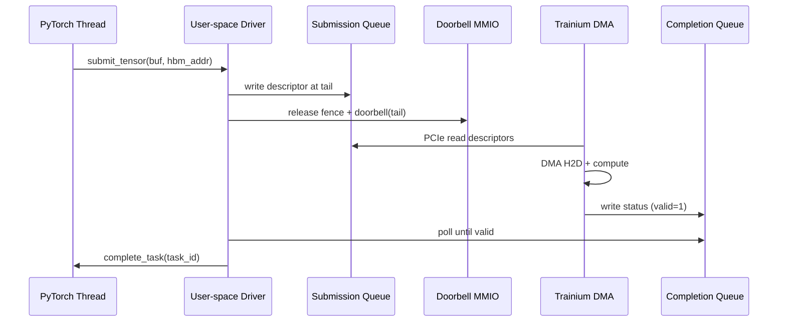

# 21 - Trainium 用户态数据面驱动架构（系统设计标准答案）

> **面试场景：** 「设计一个高性能用户态设备驱动，让 Trainium ASIC 与 Host 之间高效传输 Tensor 数据。」  
> **岗位：** AWS Nitro MLS / Trainium 底层数据面。  
> **风格：** 系统编程语言拆解 — 数据结构、控制流、HW/SW 交互、Nitro 级优化。  
> **关联：** [20-硬核面试题库](./20-Trainium-Nitro-MLS-硬核面试题库.md) G1 | [17-系统设计 Q4](./17-AWS-EC2-Nitro-系统设计.md) | [interview_handwrite/spsc_ring_buffer.cpp](../interview_handwrite/spsc_ring_buffer.cpp)

---

## 0. 面试答题框架（45 min）

| 阶段 | 时间 | 内容 |
|------|------|------|
| 需求澄清 | 5 min | 延迟目标？吞吐？polling vs 中断？单线程 vs 多线程？ |
| 高层架构 | 10 min | 画 HugePage + SQ/CQ + Doorbell + ASIC |
| 数据结构 | 10 min | Descriptor、QueuePair、对齐 |
| 生命周期 | 15 min | Produce → Doorbell → DMA → Poll |
| 优化与权衡 | 5 min | TLP 对齐、False Sharing、Compute/Comm Overlap |

**金句（开场）：**
> 数据面旁路内核：用户态直接 mmap MMIO 和 hugepage buffer，用 SQ/CQ 环形队列 + doorbell 驱动 DMA，完成路径用 polling 而非中断，追求 μs 级可预测延迟。

---

## 1. 架构总览

在用户态（User-space）直接控制硬件，需要在内存中开辟三块核心区域：

1. **大页内存池（HugePage Pool）** — Tensor 数据与队列本体  
2. **提交队列 SQ（Submission Queue）** — 软件 → 硬件  
3. **完成队列 CQ（Completion Queue）** — 硬件 → 软件  

队列区域需 **物理连续、页对齐**，以便设备 DMA 直接读取（通常配合 IOMMU 映射为 IOVA）。

```
    +-------------------------------------------------------------+
    |                      Host HugePage Memory                   |
    |  +--------------------+  +--------------------+             |
    |  |  Submission Queue  |  |   Completion Queue |             |
    |  |  (Ring Buffer)     |  |   (Ring Buffer)    |             |
    |  +--------------------+  +--------------------+             |
    |  | Tensor Data Slot 0 |  | Tensor Data Slot 1 | ...         |
    +--+--------------------+--+--------------------+-------------+
                |                            ^
     (DMA Read Descriptor)          (DMA Write Result)
                v                            |
    +-------------------------------------------------------------+
    |                     AWS Trainium ASIC                       |
    |  +--------------------+                                     |
    |  | Doorbell Register  | (MMIO Mapped)                       |
    |  +--------------------+                                     |
    +-------------------------------------------------------------+
```

### Control Plane vs Data Plane

| 平面 | 路径 | 机制 |
|------|------|------|
| **Data Plane（本文）** | PyTorch → 用户态驱动 → DMA → Trainium HBM | SQ/CQ、polling、零拷贝 |
| **Control Plane** | Host Agent → ioctl/mailbox → Firmware | 配置、复位、固件升级 |

训练 Tensor 流量**不经过** Host Agent 转发。

---

## 2. 核心数据结构

### 2.1 传输描述符 `TrainiumDesc`

队列每个槽位存的是**描述符**，不是 Tensor 本体。描述符告诉 DMA 引擎去哪里读写。

```c
// 提交给硬件的传输任务描述符
// 32 字节对齐：利于 cache line / PCIe MPS 突发传输
struct alignas(32) TrainiumDesc {
    uint64_t src_phys_addr;   // Host DMA 地址（大页池 IOVA）
    uint64_t dst_dev_addr;    // Trainium HBM 内目标地址
    uint32_t transfer_length; // 字节数
    uint16_t task_id;         // 软件侧任务追踪 ID
    uint16_t flags;           // 方向 Host→Device / Device→Host；是否产生完成事件
};
```

| 字段 | 说明 |
|------|------|
| `src_phys_addr` | 来自 pinned hugepage；IOMMU 翻译后的设备可见地址 |
| `dst_dev_addr` | 由 Neuron Runtime / 固件分配的 HBM 偏移 |
| `flags` | bit0: H2D vs D2H；bit1: fence；bit2: interrupt_on_complete（冷路径） |

### 2.2 完成状态 `TrainiumStatus`

```c
struct alignas(16) TrainiumStatus {
    uint16_t task_id;
    uint16_t status;      // 0=成功；非 0=总线/ECC/超时错误
    uint32_t reserved;
    uint64_t timestamp;   // 硬件时间戳，用于 profiling / tail latency 分析
};
```

**有效位协议（避免读到旧数据）：**

- `status` 最高位或独立 `valid` 位：硬件写完所有字段后置位  
- 软件消费后清除 `valid`，槽位才可复用  
- 类似 NVMe completion queue entry 的 phase tag 机制

### 2.3 队列对 `TrainiumQueuePair`

**Per-thread Queue Pair** — 每线程独占一对 SQ/CQ，热路径无锁。

```c
struct TrainiumQueuePair {
    // --- Submission Queue (Software → Hardware) ---
    TrainiumDesc* sq_ring;
    uint32_t sq_capacity;   // 容量 N；实际可用 N-1（留空区分满/空）

    alignas(64) uint32_t sq_tail;  // 软件 producer（仅本线程写）
    alignas(64) uint32_t sq_head;  // 硬件 consumer（硬件写或 shadow 读）

    // --- Completion Queue (Hardware → Software) ---
    TrainiumStatus* cq_ring;
    uint32_t cq_capacity;

    alignas(64) uint32_t cq_head;  // 软件 consumer

    // --- MMIO ---
    volatile uint32_t* doorbell_register;

    uint8_t current_gen;  // 可选：CQ phase / generation，防 ABA
};
```

**设计要点：**

| 要点 | 原因 |
|------|------|
| `sq_tail` / `sq_head` **分 cache line** | 消除 False Sharing（软件写 tail，硬件/另一核读 head） |
| SPSC 语义 | 单生产者（本线程）单消费者（DMA 引擎） |
| `capacity` 用 N+1 slot | 环形缓冲区区分满/空 |

**代码参考：** [spsc_ring_buffer.cpp](../interview_handwrite/spsc_ring_buffer.cpp)

---

## 3. 内存池与 Pinning

### 3.1 大页分配流程

```
1. mmap(MAP_HUGETLB | MAP_ANONYMOUS) 或 hugetlbfs
2. mlock() 锁定物理页，防止 swap
3. 注册到 IOMMU（vfio/ioctl），获取 IOVA
4. 按 64B/4KB 对齐切分 slot，放入 free list
```

### 3.2 与 PyTorch 集成

- 训练框架通过 **自定义 allocator** 从 hugepage pool 分配  
- `src_phys_addr` 在 submit 时查表获得，**热路径不做 malloc**  
- 释放：任务完成（CQ 回调）后归还 pool

**面试答法：**
> Tensor 缓冲区在初始化阶段一次性 pin 并注册 IOMMU；submit 路径只做 O(1) 查表填描述符，保证数据面无系统调用、无页错误。

---

## 4. 软硬件交互全生命周期

当 PyTorch 线程调用 `driver_submit_tensor()` 时，无锁、旁路内核的数据流如下。

### Step 1：软件填充描述符（Produce）

```
1. 读 sq_head（硬件 shadow 或 MMIO）
2. 若 (sq_tail + 1) % capacity == sq_head → 队列满，backpressure / 等待 CQ
3. 填 sq_ring[sq_tail]：IOVA、HBM 地址、长度、task_id、flags
4. sq_tail = (sq_tail + 1) % capacity
```

```cpp
bool submit(TrainiumQueuePair* qp, const TensorBuf& buf, uint64_t hbm_addr) {
    const uint32_t next = (qp->sq_tail + 1) % qp->sq_capacity;
    if (next == qp->sq_head) return false;  // full

  TrainiumDesc& d = qp->sq_ring[qp->sq_tail];
    d.src_phys_addr = buf.iova;
    d.dst_dev_addr = hbm_addr;
    d.transfer_length = buf.size;
    d.task_id = buf.task_id;
    d.flags = FLAG_H2D;

    qp->sq_tail = next;
    return true;
}
```

### Step 2：敲门铃（Doorbell）

确保描述符对设备可见后，再写 doorbell。

```cpp
std::atomic_thread_fence(std::memory_order_release);

// MMIO write：通知 DMA 引擎有新的 SQ tail
*qp->doorbell_register = qp->sq_tail;
```

| 屏障 | 作用 |
|------|------|
| `release` fence | 保证 SQ 槽位写入在 doorbell 之前对设备可见 |
| doorbell MMIO | 设备侧唤醒 fetch 逻辑（类似 NVMe、GPU command queue） |

### Step 3：硬件 DMA（Hardware）

```
1. Trainium 检测 doorbell 更新
2. DMA 引擎读取 Host SQ（PCIe Read）
3. 按 src_phys_addr 发起 DMA Read → 数据进 HBM
4. （可选）片上执行算子
5. 完成后写 CQ[slot]（DMA Write），置 valid 位
```

**PCIe 路径：** Host DRAM ←PCIe→ Trainium HBM（不经 CPU 拷贝）

### Step 4：用户态轮询完成（Poll Consume）

数据面**默认不用中断**；专职 polling 线程或计算线程同步 poll。

```cpp
void poll_completion(TrainiumQueuePair* qp) {
    while (true) {
        TrainiumStatus* st = &qp->cq_ring[qp->cq_head];

        if (st->status & STATUS_VALID_MASK) {
            std::atomic_thread_fence(std::memory_order_acquire);

            if (st->status & STATUS_ERROR_MASK) {
                handle_error(st->task_id, st->status);
            } else {
                complete_task(st->task_id);
            }

            st->status &= ~STATUS_VALID_MASK;  // 释放槽位
            qp->cq_head = (qp->cq_head + 1) % qp->cq_capacity;
            return;
        }

#if defined(__x86_64__)
        _mm_pause();
#elif defined(__aarch64__)
        __asm__ __volatile__("yield" ::: "memory");  // Graviton
#endif
    }
}
```

### 中断 vs Polling 权衡

| | Polling | 中断 |
|---|---------|------|
| 延迟 | 低、可预测 | 高（上下文切换） |
| CPU | 占满 core | 省电 |
| 适用 | **数据面热路径** | 控制面、稀疏事件 |
| 混合 | 自适应：忙轮询 N 次后 `yield`/休眠 | Nitro 常见策略 |

---

## 5. 端到端时序图



---

## 6. Nitro 级优化点（面试官加分项）

### 6.1 PCIe TLP 与内存对齐

**内幕：** PCIe 以 **TLP (Transaction Layer Packet)** 传输。起始地址未对齐（如非 64B）时，一个逻辑块可能拆成多个 TLP，**有效带宽下降**。

**面试表达：**
> 内存池强制 **64B（cache line）甚至 4KB（页）** 对齐，匹配 Max Payload Size，触发 PCIe Gen5/Gen6 最优突发传输，最大化 H2D 带宽。

### 6.2 False Sharing 隔离

**内幕：** `sq_tail` 与 `sq_head` 若在同一 cache line，一核写 tail 导致他核 head 缓存失效。

**面试表达：**
> 对 `sq_tail`、`sq_head`、`cq_head` 使用 `alignas(64)` 或 C++17 `hardware_destructive_interference_size` 隔离，消除多 QP 多核间的伪共享。

**代码参考：** [10_concurrency_atomic.cpp](../amazon_cpp/examples/10_concurrency_atomic.cpp)

### 6.3 计算与通信重叠（Overlap）

> **集群级完整题解（MFU、双队列、Chunking、EFA/SRD）：** [22-LLM训练计算通信重叠与MFU优化.md](./22-LLM训练计算通信重叠与MFU优化.md)

**内幕：** 大模型训练中，层 N 在 Trainium 上计算时，层 N+1 权重应已在 SQ 中异步提交。

```
时间线:
  [H2D weights L+1] [Compute L] [H2D weights L+2] [Compute L+1] ...
       ↑ SQ submit      ↑ 片上           ↑ 异步
```

**面试表达：**
> 驱动 API **异步非阻塞**：`submit` 立即返回，完成通过 CQ poll / callback。多级 SQ 流水线 + Neuron 编译器图调度，把 MFU 推向理论上限。通信时间隐藏在计算之下。

### 6.4 与 RDMA / NVMe-oF / io_uring 的思想对照

| 技术 | 共同点 |
|------|--------|
| **NVMe** | SQ/CQ + doorbell + phase tag |
| **RDMA** | 零拷贝、预注册内存、完成队列 |
| **io_uring** | 共享 ring、批量提交、减少 syscall |
| **DPDK** | 用户态 polling、hugepage、per-core queue |

**面试金句：**
> 这套架构是 NVMe + RDMA 范式在 AI 加速器上的特化：描述符队列、doorbell、完成轮询，区别在于地址空间一侧是 Trainium HBM 而非远端 NIC 内存。

---

## 7. 可靠性、错误处理与可观测性

| 场景 | 处理 |
|------|------|
| DMA 超时 | CQ 无完成 → watchdog → 重置 queue pair |
| ECC / 总线错误 | `status` 错误码 → 上报 Host Agent → 标记芯片 unhealthy |
| 队列满 | 返回 EAGAIN；上层 backpressure 或等 CQ 腾出 SQ 空间 |
| 固件升级 | 控制面 drain → 停止 doorbell → 重置 → 恢复 |
| Profiling | `timestamp` 字段算 H2D 延迟 p50/p99 |

**指标：**
- H2D 带宽利用率（GB/s / 理论 PCIe 带宽）
- SQ 占用率、CQ 消费延迟
- 每 `task_id` 端到端 latency

---

## 8. 常见 Follow-up 与参考答案

### Q1: 为什么用 Huge Pages？

> 减少 TLB miss；DMA 映射稳定；大 buffer 连续，利于 PCIe 突发。配合 `mlock` 防 swap。

### Q2: IOMMU 做什么？

> 设备只能访问已注册的 IOVA 范围，防止恶意或 buggy DMA 读写任意物理内存。`src_phys_addr` 实际是 IOVA 而非任意 PA。

### Q3: 多线程怎么扩展？

> **每线程一个 Queue Pair**（本设计），避免 MPMC 锁。全局资源用 per-core pool。若必须 MPMC，见 [thread_safe_ring_buffer.cpp](../interview_handwrite/thread_safe_ring_buffer.cpp) 或 Disruptor sequence。

### Q4: ARM (Graviton) 上有什么不同？

> `yield` 代替 `_mm_pause`；内存模型仍用 acquire/release；注意 weaker memory model 下 fence 不可省略；NUMA 绑定 Trainium 所在 socket。

### Q5: 和内核驱动比，用户态驱动的代价？

| 优 | 劣 |
|----|-----|
| 无 syscall 热路径 | 需 vfio/UIO 映射设备 |
| polling 低延迟 | 占用 CPU |
| 快速迭代 | 安全隔离依赖 IOMMU |

### Q6: 如何与 Neuron Compiler 配合？

> 编译器静态分配 HBM 地址 → runtime 填 `dst_dev_addr`；计算与 DMA 在编译图中插入 dependency；驱动只执行「搬运 + 完成信号」。

---

## 9. 白板手写顺序建议

1. 画 HugePage + SQ/CQ + ASIC + doorbell（2 min）  
2. 写 `TrainiumDesc` / `TrainiumQueuePair`（5 min）  
3. 讲四步生命周期：produce → fence → doorbell → poll（8 min）  
4. 主动提三项优化：TLP 对齐、false sharing、overlap（5 min）  
5. Follow-up：IOMMU、多 QP、错误处理（5 min）

---

## 10. 相关仓库材料

| 主题 | 路径 |
|------|------|
| SPSC Ring Buffer 手撕 | [interview_handwrite/spsc_ring_buffer.cpp](../interview_handwrite/spsc_ring_buffer.cpp) |
| False Sharing | [amazon_cpp/examples/10_concurrency_atomic.cpp](../amazon_cpp/examples/10_concurrency_atomic.cpp) |
| 用户态驱动系统设计 | [20-题库 G1](./20-Trainium-Nitro-MLS-硬核面试题库.md) |
| Host Agent 控制面 | [17-系统设计 Q4](./17-AWS-EC2-Nitro-系统设计.md) |
| DMA / mmap / Huge Pages | [19-知识点详解](./19-AWS-Nitro-MLS-面试知识点详解.md) |

---

## 11. 一页纸速记

```
内存: HugePage Pool + IOMMU IOVA + 64B/4KB 对齐
队列: SQ (软件→硬件) + CQ (硬件→软件), per-thread QP, SPSC
描述符: src IOVA, dst HBM, len, task_id, flags
流程: fill SQ → release fence → doorbell → DMA → poll CQ
优化: TLP 对齐 | alignas(64) 防 false sharing | 异步 overlap 提 MFU
对照: NVMe SQ/CQ + RDMA 零拷贝 + DPDK polling
分离: Data plane (本文) vs Control plane (Host Agent)
```
