# 22 - LLM 训练：计算通信重叠与 MFU 优化（系统设计标准答案）

> **面试场景：** 「设计多芯片协同的参数同步机制，让计算与通信重叠，最大化 MFU。」  
> **岗位：** AWS Nitro MLS / Trainium 大规模训练基础设施。  
> **核心指标：** **MFU（Model FLOPs Utilization）** — 实际有效算力 / 理论峰值算力。  
> **关联：** [21-用户态数据面驱动](./21-Trainium-用户态数据面驱动架构.md) | [17-系统设计 Q3](./17-AWS-EC2-Nitro-系统设计.md) | [20-题库 G2](./20-Trainium-Nitro-MLS-硬核面试题库.md) | Microsoft Principal 并行策略见 [26](./26-Microsoft-Principal-ML-Systems面试准备.md)

---

## 0. 面试答题框架（45 min）

| 阶段 | 时间 | 内容 |
|------|------|------|
| 定义问题 | 5 min | MFU 是什么？为何通信杀死 MFU？ |
| 数学直觉 | 5 min | Backward 逐层 → 为何可重叠 |
| 架构 | 15 min | 双队列 + 双缓冲 + 硬件 fence |
| 流水线代码 | 10 min | OverlapPipelineManager 逻辑 |
| Nitro 级优化 | 10 min | Chunking、EFA/SRD、Hardware Fence |

**开场金句：**
> 万卡 LLM 训练的系统优化，本质上是压榨时钟周期：在 Tensor Core 算 Layer N−1 的同时，用 DMA/EFA 异步同步 Layer N 的梯度。MFU 从 30% 拉到 50–70% 靠的是重叠流水线，不是单卡峰值 FLOPS。

---

## 1. MFU：为什么它是核心指标？

### 1.1 定义

$$\text{MFU} = \frac{\text{实际 achieved FLOPs/s（整个 job）}}{\text{硬件理论峰值 FLOPs/s}}$$

| MFU 区间 | 含义（大模型训练经验值） |
|----------|--------------------------|
| < 30% | 严重 bound 于通信、调度或 I/O |
| 30–45% | 常见未优化集群 |
| 45–55% | 较好优化（overlap + 拓扑） |
| 55–70%+ | 顶尖工程（chunking + EFA + 编译器协同） |

### 1.2 MFU 暴跌的典型原因

```
Step 时间 = T_compute + T_comm + T_idle（气泡）

无重叠时:  T_step ≈ T_forward + T_backward + T_allreduce  （串行相加）
有重叠时:  T_step ≈ T_forward + max(T_backward_comm_overlap) （取 max）
```

| 瓶颈 | 表现 |
|------|------|
| **通信** | AllReduce 时全员等待最慢 rank（straggler） |
| **尾部延迟** | p99 通信 >> p50 → 整体 step 被 tail 拉死 |
| **气泡** | 短层算太快，通信来不及隐藏 |
| **Host 介入** | CPU 同步、拷贝、未 pin 内存导致 DMA stall |

**Nitro MLS 视角：** 单卡 HBM 带宽和 Tensor Core 峰值只是上限；**集群 MFU 由网络 + 驱动 + 编译器流水线决定**。

---

## 2. 核心数学基础：Backward 为何可以重叠？

Transformer 反向传播按层从 $L$ 到 $1$ 推进：

$$\text{Layer } L \rightarrow \text{Layer } L-1 \rightarrow \cdots \rightarrow \text{Layer } 1$$

**关键性质：** Layer $i$ 的梯度一旦算完，**不必等**其他层完成，即可发起该层梯度的集合通信（Reduce-Scatter / All-Reduce，取决于并行策略）。

```
时间 ──────────────────────────────────────────────→

无重叠:
  [Bw L] [Bw L-1] ... [Bw 1] | [AllReduce 全部梯度]

有重叠 (layer-wise):
  [Bw L] ──────────────────────────────
         [RS L]   [Bw L-1] ─────────────
                    [RS L-1]  [Bw L-2] ...
```

### 2.1 与并行策略的关系

| 策略 | 主要通信 | 重叠单元 |
|------|----------|----------|
| **Data Parallel (DP)** | AllReduce 梯度 | backward bucket / layer |
| **Tensor Parallel (TP)** | AllReduce / AllGather 激活或梯度 | 每层内 column/row |
| **Pipeline Parallel (PP)** | P2P 传递 activation | micro-batch 级 |
| **FSDP / ZeRO-3** | ReduceScatter + AllGather | 参数分片 bucket |

**面试答法：** Overlap 不只属于 DP；任何「先产生一块数据、再需要通信」的模式都可以 micro-pipeline。

---

## 3. 软硬件数据流水线架构

### 3.1 逻辑拓扑（双引擎并行）

```
     [ 加速器计算核心 (Compute Engine) ]       [ DMA / 网络引擎 (EFA / NeuronLink) ]
                     |                                       |
    (1) 计算 Layer N 梯度 → 写入 Buffer A                  |
                     |                                       |
    (2) 切换 Buffer B，计算 Layer N-1  ←──【并行】──→  (3) 异步 RS/AR Buffer A
                     |                                       |
                     v                                       v
              Trainium HBM                              跨节点 EFA (SRD)
```

### 3.2 为什么不能只靠单队列？

| 单队列问题 | 双队列方案 |
|------------|------------|
| 计算与通信描述符混在一起，硬件难并行 | **Compute Queue** + **Network Queue** 独立 |
| 通信阻塞计算提交 | 各自 doorbell、各自 CQ |
| CPU 需协调顺序 | **Hardware Fence / Token** 设备间同步 |

### 3.3 底层关键组件

#### （1）控制面任务环形队列

软件（Neuron Runtime）向驱动提交**非阻塞描述符链**，不直接搬数据：

```c
struct ComputeDesc {
    uint32_t layer_id;
    uint64_t hbm_addr;
    uint32_t op_id;          // 算子 kernel id
    uint64_t fence_token;    // 完成后 signal 的 token
};

struct CommDesc {
    uint32_t layer_id;
    uint64_t hbm_addr;       // 梯度 chunk 地址
    uint32_t chunk_id;
    uint32_t collective;     // REDUCE_SCATTER / ALL_REDUCE / ALL_GATHER
    uint64_t wait_token;     // 等待 compute fence
    uint64_t signal_token;   // 通信完成 signal
};
```

#### （2）硬件 Token / Fence（零 CPU 同步）

```
Compute Engine 写完梯度
    → MMIO write Fence Register (release)
    → Network Engine DMA 监听到位
    → 自动拉取 HBM chunk → EFA Reduce-Scatter
    → 完成写 CQ，signal_token 就绪
```

**与 [21-用户态驱动](./21-Trainium-用户态数据面驱动架构.md) 的关系：**
- 21 文档：Host ↔ Trainium **H2D/D2H** 单队列模型  
- 本文：**片内 Compute + 片间 Comm** 双队列 + 硬件 fence，是 21 的集群级扩展

---

## 4. 双缓冲 + 流水线管理器

### 4.1 数据结构

```cpp
struct LayerBuffer {
    uint32_t layer_id;
    void* buf_a;           // 双缓冲 A（HBM 或 pinned host）
    void* buf_b;           // 双缓冲 B
    bool use_a = true;
};

enum EventType { TYPE_COMPUTE, TYPE_COMM };

struct HardwareEvent {
    uint32_t layer_id;
    uint32_t chunk_id;
    EventType type;
    uint64_t token;
};
```

### 4.2 反向传播流水线（核心逻辑）

```cpp
class OverlapPipelineManager {
public:
    void run_backward_pass(std::vector<LayerBuffer>& layers) {
        for (int i = static_cast<int>(layers.size()) - 1; i >= 0; --i) {
            LayerBuffer& layer = layers[i];
            void* active = layer.use_a ? layer.buf_a : layer.buf_b;

            // (1) 非阻塞：提交当前层梯度计算
            HardwareEvent compute_ev =
                submit_gradient_computation(layer.layer_id, active);

            // (2) 重叠：上一层梯度已就绪 → 异步集合通信
            if (i + 1 < static_cast<int>(layers.size())) {
                LayerBuffer& prev = layers[i + 1];
                void* comm_buf = prev.use_a ? prev.buf_a : prev.buf_b;

                // 等待 prev 层 compute fence（硬件自动，非 CPU spin）
                HardwareEvent comm_ev =
                    submit_network_collective(prev.layer_id, comm_buf);
                track_event(comm_ev);
            }

            layer.use_a = !layer.use_a;

            // (3) 预取下一层权重/描述符到 SRAM
            if (i > 0) prefetch_layer_descriptors(i - 1);
        }
        wait_all_events();  // 仅 step 末 flush
    }

private:
    HardwareEvent submit_gradient_computation(uint32_t layer_id, void* buf) {
        // 写 Compute SQ → doorbell
        return {layer_id, 0, TYPE_COMPUTE, alloc_token()};
    }

    HardwareEvent submit_network_collective(uint32_t layer_id, void* buf) {
        // 写 Network SQ → EFA libfabric → doorbell
        return {layer_id, 0, TYPE_COMM, alloc_token()};
    }

    void track_event(HardwareEvent) {}
    void prefetch_layer_descriptors(int) {}
    void wait_all_events() {}
};
```

### 4.3 流水线时序（Mermaid）

```mermaid
gantt
    title Backward Pass with Overlap (3 layers)
    dateFormat X
    axisFormat %s

    section Layer 2
    Bw L2           :a1, 0, 3
    RS L2           :a2, 3, 6

    section Layer 1
    Bw L1           :b1, 3, 6
    RS L1           :b2, 6, 9

    section Layer 0
    Bw L0           :c1, 6, 9
    RS L0           :c2, 9, 12
```



> 注：理想情况下 `Bw L1` 与 `RS L2` 时间重叠。

---

## 5. Nitro / AWS 级硬核优化

### 5.1 集合通信切片（Communication Chunking）

**痛点：** 整层梯度一次 Reduce-Scatter → 启动延迟高（latency-bound），流水线前端空转。

**解法：** 编译器 + 驱动将大 Tensor 切成 **4–16 MB chunks**：

```
Layer N backward:
  chunk0 算完 → 立刻 RS chunk0  （不等 chunk1..k）
  chunk1 算完 → 立刻 RS chunk1
  ...
```

| | 整层通信 | Chunk 微流水线 |
|---|----------|----------------|
| 启动次数 | 1 次/层 | k 次/层 |
| 首次通信时刻 | 层末 | 第一个 chunk 完成时 |
| 气泡 | 大 | 小 |
| 适合 | 层厚、计算长 | 层薄、通信相对长 |

**面试表达：**
> 当 $T_{\text{comm}} > T_{\text{compute}}$ 单层时，layer-wise overlap 不够，必须 chunk-wise micro-pipelining 把缝隙填满。

### 5.2 EFA 与 SRD：跨节点旁路

**架构位置：**

```
Trainium HBM
    → 片内 DMA
    → EFA NIC (用户态 libfabric)
    → SRD 多路径 fabric
    → 远端 Trainium
```

| 协议 | 问题 | SRD 优势 |
|------|------|----------|
| TCP | 队头阻塞、内核栈、tail latency | — |
| 传统 RDMA | 单路径拥塞阻塞全局 | — |
| **SRD** | — | 多路径、无序交付、在端点重组 |

**面试表达：**
> 驱动对接 EFA 用户态（Libfabric）。SRD 消除 HoL blocking：某路径抖动时，其他路径 chunk 照达，straggler 对 MFU 的伤害被稀释。这与 chunking 叠加效果最好。

**详见：** [19-知识点 EFA/SRD](./19-AWS-Nitro-MLS-面试知识点详解.md) | [17-Q3 分布式训练](./17-AWS-EC2-Nitro-系统设计.md)

### 5.3 硬件 Fence：Device-to-Device 协同

**原则：** CPU **不应**在热路径 spin 等通信完成。

```
Compute Engine:
  写完 chunk → 写 Fence Reg (memory_order_release)

Network Engine:
  轮询 / 中断 Fence Reg (acquire)
  → DMA read chunk from HBM
  → EFA RS
  → 写 CQ
```

| 机制 | 层级 |
|------|------|
| `std::atomic` fence | Host 多线程 |
| **Hardware Mailbox / Semaphore** | 片内 Compute ↔ Network |
| **CQ valid bit** | 完成通知（同 [21-文档](./21-Trainium-用户态数据面驱动架构.md)） |

**面试表达：**
> Release 语义的硬件栅栏确保梯度写入 HBM 对 DMA 可见后，网络引擎才拉取——全程无 Host CPU 介入，实现 device-to-device coordination。

### 5.4 其他 MFU 杠杆（简表）

| 优化 | 作用 |
|------|------|
| **拓扑感知 NCCL/Neuron** | 同 rail 优先，减 hop |
| **梯度累积** | 增大 effective batch，摊薄通信频率 |
| **BF16/FP8** | 梯度体积减半 → 通信时间减半 |
| **重叠 optimizer** | AllGather 参数与 optimizer step 并行（FSDP） |
| **NUMA / hugepage** | 减 Host 侧 DMA stall |

---

## 6. 故障与边界情况

### Q: 某层计算极快，通信比计算慢，流水线断了怎么办？

**答：**
1. **Chunking** — 把通信拆细，不等整层  
2. **Gradient accumulation** — 多 micro-batch 再通信一次  
3. **调整并行策略** — 通信重时增 TP、减 DP，或换 ZeRO stage  
4. **检查 straggler** — 慢节点/慢网卡拉高 p99

### Q: 如何保证数值正确性？

- Fence 顺序：compute fence → comm 开始 → comm CQ → optimizer  
- 同一 chunk 不允许读写竞争（双缓冲或 generation tag）  
- Step 末 `wait_all_events()` 全局 flush

### Q: 如何观测 MFU？

| 指标 | 工具 |
|------|------|
|  achieved FLOPs | 编译器/roofline 模型 + 实测 step 时间 |
| 通信占比 | NCCL profiler / Neuron profiler |
| 气泡时间 | timeline：compute stream vs comm stream |
| 网络 tail | EFA counters, p99 latency |

---

## 7. 与 Neuron SDK / 编译器的分工

```
┌─────────────────────────────────────────────────────────┐
│ Neuron Compiler (编译时)                                 │
│  - 算子融合、分 chunk、插入 comm 点                        │
│  - 静态 HBM 布局、layer → address 映射                   │
└────────────────────────┬────────────────────────────────┘
                         ↓ NEFF / 执行图
┌─────────────────────────────────────────────────────────┐
│ Neuron Runtime (运行时)                                  │
│  - 填 ComputeDesc / CommDesc                             │
│  - 管理 token / event graph                              │
└────────────────────────┬────────────────────────────────┘
                         ↓
┌─────────────────────────────────────────────────────────┐
│ User-space Driver (本文 + 21-文档)                        │
│  - SQ/CQ、doorbell、EFA 提交、polling                     │
└─────────────────────────────────────────────────────────┘
```

**面试分工表述：**
> 编译器决定「何时、哪块梯度可以通信」；Runtime 建 event DAG；驱动负责无阻塞提交与完成回收——三层协同才能把 overlap 做实。

---

## 8. 白板手写顺序（45 min）

1. **写 MFU 公式** + 串行 step 时间 vs 重叠 step 时间（3 min）  
2. **画 Backward 逐层图** + layer-wise overlap 时间条（5 min）  
3. **画 Compute Engine ∥ Network Engine** + 双队列（7 min）  
4. **写 OverlapPipelineManager 伪代码** 核心循环（10 min）  
5. **讲三项优化**：Chunking、EFA/SRD、Hardware Fence（10 min）  
6. **Follow-up**：短层气泡、FSDP、观测指标（10 min）

---

## 9. 常见 Follow-up 速查

| 问题 | 要点 |
|------|------|
| AllReduce vs Reduce-Scatter | DP 用 AR；ZeRO/FSDP 用 RS+AG |
| Ring vs Tree AllReduce | Ring 带宽优；Tree 延迟优；NCCL 自动选 |
| 气泡（pipeline bubble） | PP 特有；可用 interleaved 1F1B 减气泡 |
| MFU vs HFU | MFU 含通信/idle；HFU 仅看 compute kernel |
| 30% → 70% MFU 现实吗？ | 70% 是顶尖；50%+ 已是很好工程 |
| Host 还要做什么？ | 提交描述符、低频 flush；不在热路径 memcpy |

---

## 10. 一页纸速记

```
MFU = achieved FLOPs / peak FLOPs；通信 tail 是万卡杀手

重叠基础: Backward 逐层 → Layer i 算完即可 RS/AR，不必等全网

架构: Compute Queue ∥ Network Queue；双缓冲；Hardware Fence/token

微流水线: 梯度切 chunk (4–16MB)，算完一片发一片

网络: EFA + SRD 多路径，无 HoL blocking，抗 tail latency

零 CPU 热路径: Compute fence → DMA/EFA 自动拉取 → CQ

编译器/runtime/驱动 三层分工建 event DAG

目标: step 时间 ≈ forward + backward（通信藏在其下）
```

---

## 11. 相关文档

| 主题 | 路径 |
|------|------|
| H2D 用户态驱动 SQ/CQ | [21-Trainium-用户态数据面驱动架构.md](./21-Trainium-用户态数据面驱动架构.md) |
| 分布式训练系统设计 | [17-AWS-EC2-Nitro-系统设计.md](./17-AWS-EC2-Nitro-系统设计.md) Q3 |
| EFA / NCCL / Overlap 概念 | [19-AWS-Nitro-MLS-面试知识点详解.md](./19-AWS-Nitro-MLS-面试知识点详解.md) |
| G2 系统设计题入口 | [20-Trainium-Nitro-MLS-硬核面试题库.md](./20-Trainium-Nitro-MLS-硬核面试题库.md) G2 |
