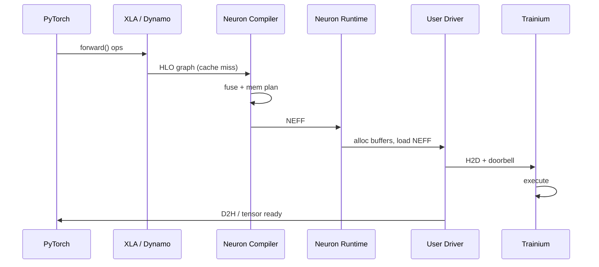

# 23 - Neuron 编译运行时与数据面 Lua（Compiler & Runtime 标准答案）

> **岗位定位：** 上接 PyTorch，下接 Trainium 用户态驱动 — Nitro MLS 团队的**软硬件桥梁**。  
> **面试场景：** 「PyTorch 代码如何跑到 Trainium 上？」「数据面为什么用 Lua？」  
> **关联：** [21-用户态驱动](./21-Trainium-用户态数据面驱动架构.md) | [22-MFU重叠流水线](./22-LLM训练计算通信重叠与MFU优化.md) | [20-题库 F 模块](./20-Trainium-Nitro-MLS-硬核面试题库.md)

---

## 0. 全局视野（面试开场 30 秒）

```
PyTorch (Eager / compile)
    ↓ 图捕获
XLA HLO IR
    ↓ Neuron Compiler（融合、内存规划）
NEFF 可执行文件
    ↓ Runtime + 用户态驱动（21-文档）
Trainium 机器码执行 + DMA + EFA 通信（22-文档）
    ↑ 策略热更新（Lua，本文）
```

**金句：**
> 这个岗位的本质，是用极致的底层软件（C/C++/Lua/驱动），把昂贵复杂的 Trainium/Nitro 硬件伪装成标准、高效的 PyTorch 算力。

---

## 0.1 面试答题框架（30–45 min）

| 阶段 | 时间 | 内容 |
|------|------|------|
| 端到端路径 | 10 min | PyTorch → HLO → NEFF → 驱动加载 |
| 编译优化 | 10 min | 融合、SRAM/HBM 规划 |
| Lua 角色 | 10 min | 为何嵌入、C API、GC/FFI 避坑 |
| 与驱动衔接 | 10 min | NEFF 加载、SQ 提交、Lua 选队列 |
| Follow-up | 5 min | torch.compile vs XLA、动态 shape |

---

# 第一部分：从 PyTorch 到 Trainium 机器码

## 1.1 四阶段流水线

```
 +------------------+     (Lazy Tensor / TorchDynamo)     +--------------------+
 |  PyTorch Frontend| ----------------------------------> |  XLA HLO Graph     |
 +------------------+                                     +--------------------+
                                                                    |
                                                                    | Neuron Compiler
                                                                    v
 +------------------+       (Runtime + User Driver)        +--------------------+
 | Trainium Machine | <---------------------------------- |   NEFF Executable  |
 | Code & Assembly  |                                     | (registers, alloc) |
 +------------------+                                     +--------------------+
```

| 阶段 | 组件 | 产出 |
|------|------|------|
| **1. 前端** | PyTorch、`torch_xla`、`torch_neuronx` | FX / HLO 图 |
| **2. 编译** | Neuron Compiler（基于 XLA） | 优化后 IR + 内存计划 |
| **3. 链接** | NEFF 生成 | 机器码 + 静态分配表 |
| **4. 执行** | Neuron Runtime + 驱动 | DMA 提交、doorbell、CQ poll |

---

## 1.2 图捕获与延迟执行（Graph Capture & Lazy Execution）

### Eager vs Graph

| 模式 | 行为 | 优缺点 |
|------|------|--------|
| **Eager** | 算一行执行一行 | 灵活、难全局优化 |
| **Graph / Lazy** | 先建图，再一次性编译执行 | 可融合、可静态分配内存 |

**Neuron 路径：**
- 传统：`torch_xla` **Lazy Tensor** — 算子先入图，遇到 materialize 点（`.item()`、`.backward()`、显式 `mark_step`）才编译执行
- 现代：`torch.compile` / **TorchDynamo** 捕获 Python 级子图 → 后端 lower 到 XLA/Neuron

**面试答法：**
> 硬件看不懂 `nn.Linear` 一行行调用。必须先把多算子收成图，编译器才能做融合和 SRAM 分配。Neuron 用 XLA lazy execution 或 Dynamo 捕获实现这一点。

### 常见 Follow-up

**Q: 什么时候触发编译？**
- 首次见到某 shape 的图 → 编译（compilation cache）
- 动态 shape 变化 → 可能 recompile（性能坑）

**Q: `torch.compile` 和 XLA 关系？**
- Dynamo 前端捕图；后端可选 Inductor（GPU）、**XLA（TPU/Trainium）**
- Neuron 栈：Dynamo → XLA HLO → Neuron Compiler

---

## 1.3 中间表示：HLO IR 与编译优化

### HLO (High Level Operations)

计算图捕获后翻译为 XLA HLO，例如：

```
%0 = parameter(0)   // input
%1 = convolution(%0, ...)
%2 = add(%1, bias)
%3 = relu(%2)
```

### Neuron Compiler 核心竞争力

#### （1）算子融合（Operator Fusion）

```
未融合:  Conv → write HBM → Add → write HBM → ReLU → write HBM
融合后:  FusedConvAddRelu → 一次读写 HBM
```

| 收益 | 说明 |
|------|------|
| 带宽 | 减少 HBM 往返（memory-bound 算子关键） |
| 延迟 | 少 kernel launch |
| 能耗 | 更少数据移动 |

**面试举例：**
> LayerNorm + Linear 融合、Attention 子图融合（类 FlashAttention 思路）——把中间激活留在片上 SRAM。

#### （2）内存分配规划（Memory Planning）

| 存储 | 特点 | 编译器决策 |
|------|------|------------|
| **SRAM（片上）** | 极小、极快 | 热张量、融合中间结果 |
| **HBM** | 大、相对慢 | 权重、大块激活、checkpoint |

**问题形式：** 图着色 / 生命周期分析 — 张量死了就回收槽位给后续算子。

#### （3）其他常见优化

| 优化 | 说明 |
|------|------|
| 常量折叠 | 编译期算死常量 |
| 布局转换 | NCHW ↔ 硬件友好 layout |
| 通信插入 | 多芯片时插入 AllReduce 点（衔接 [22-文档](./22-LLM训练计算通信重叠与MFU优化.md)） |
| 算子降级 | 不支持的 op fallback 到 CPU |

---

## 1.4 NEFF：目标可执行文件

### 什么是 NEFF？

**NEFF (Neuron Executable File Format)** — Neuron Compiler 输出的二进制包，包含：

| 内容 | 说明 |
|------|------|
| **机器码 / 微码** | Trainium 执行单元指令流 |
| **静态内存映射表** | 权重、激活在 HBM 的偏移 |
| **常量 blob** | 编译期绑定的参数 |
| **元数据** | 输入/输出 shape、dtype、chip 拓扑 |

### Runtime + 驱动职责（衔接 21-文档）

```
1. 加载 NEFF 到设备（或缓存已加载实例）
2. 按静态表在 HBM / hugepage pool 分配 buffer
3. H2D：权重/输入 DMA 到 HBM（SQ/CQ + doorbell）
4. 写控制寄存器启动执行引擎
5. 执行中：按 [22] 重叠流水触发通信
6. D2H 或片内消费输出；CQ poll 完成
```

**面试答法：**
> 编译器决定「算什么、放哪」；Runtime 建执行上下文；驱动负责 NEFF 加载、DMA 描述符和 doorbell——和我设计的用户态 SQ/CQ 模型直接对接。

---

## 1.5 端到端时序（单 Step 推理/训练）



---

## 1.6 编译运行时高频面试题

| # | 问题 | 要点 |
|---|------|------|
| 1 | PyTorch 如何到 Trainium？ | Dynamo/Lazy → HLO → NEFF → Runtime/Driver |
| 2 | 为何需要图模式？ | 融合、静态内存规划、多芯通信调度 |
| 3 | 算子融合解决什么？ | Memory-bound、HBM 带宽 |
| 4 | NEFF 里有什么？ | 机器码 + 内存映射 + 常量 |
| 5 | 动态 shape 怎么办？ | 多版本 NEFF cache；或 padding 到静态 bucket |
| 6 | 编译很慢怎么缓解？ | 持久化编译缓存、warmup run |
| 7 | 和 CUDA 栈对比？ | CUDA: cuDNN/cuBLAS 库调用；Trainium: 编译到专用 ISA |
| 8 | XLA 和 Neuron Compiler 分工？ | XLA 通用 HLO 优化；Neuron 后端做芯片特化 |

---

# 第二部分：数据面中的 Lua

## 2.1 为什么底层系统用 C/C++ + Lua？

| 需求 | C/C++ | Lua |
|------|-------|-----|
| 热路径吞吐 | ✅ DMA、doorbell、polling | |
| 动态策略 | 改策略要重编译 | ✅ 热加载脚本 |
| 嵌入成本 | — | 解释器 ~几百 KB |
| 执行速度 | 原生 | **LuaJIT** 接近 C |

**Trainium / Nitro 场景：**
- 网络路由、队列选择、负载均衡权重
- A/B 调度策略、拥塞控制参数
- **万卡集群** — 不能为改一行策略重启驱动

**同类先例：** Nginx/OpenResty、Redis 脚本、网络设备 control plane

---

## 2.2 Lua 在数据面的职责边界

```
┌─────────────────────────────────────────────────┐
│  C/C++ 驱动（热路径）                            │
│  SQ/CQ · DMA · doorbell · polling · EFA        │
└────────────────────┬────────────────────────────┘
                     │ 策略查询（低频 / 每 chunk）
                     ▼
┌─────────────────────────────────────────────────┐
│  Lua 策略层（冷/温路径）                         │
│  select_target_queue(tensor_size, link_status)   │
│  route_policy.lua — 可热替换                     │
└─────────────────────────────────────────────────┘
```

**原则：** Lua **不在**每字节 DMA 路径上；只在**调度决策点**被调用（如选哪个 SQ、是否走备用 EFA 路径）。

---

## 2.3 Lua C API：虚拟栈交互（面试手撕级）

### 核心模型

- 所有 C↔Lua 数据通过 **虚拟栈** 传递
- 正数索引从栈底数，`-1` 是栈顶

### 完整示例：动态选择硬件队列

```cpp
#include <lua.hpp>
#include <iostream>

void execute_routing_policy(uint32_t tensor_size, uint32_t link_status) {
    lua_State* L = luaL_newstate();
    luaL_openlibs(L);

  if (luaL_dofile(L, "network_policy.lua") != LUA_OK) {
        std::cerr << "load error: " << lua_tostring(L, -1) << "\n";
        lua_close(L);
        return;
    }

    lua_getglobal(L, "select_target_queue");

    lua_pushinteger(L, tensor_size);
    lua_pushinteger(L, link_status);

    if (lua_pcall(L, 2, 1, 0) != LUA_OK) {
        std::cerr << "runtime error: " << lua_tostring(L, -1) << "\n";
    } else {
        if (lua_isinteger(L, -1)) {
            int queue_id = static_cast<int>(lua_tointeger(L, -1));
            // 驱动将描述符写入 queue_id 对应 SQ
            submit_to_sq(queue_id, tensor_size);
        }
        lua_pop(L, 1);
    }

    lua_close(L);
}
```

**对应 `network_policy.lua`：**

```lua
function select_target_queue(tensor_size, link_status)
    -- link_status: 0=idle, 1=congested, 2=degraded
    if link_status >= 2 then
        return 2  -- backup queue / path
    elseif tensor_size > 4 * 1024 * 1024 then
        return 1  -- bulk queue
    end
    return 0      -- default low-latency queue
end
```

### API 速查

| API | 作用 |
|-----|------|
| `luaL_newstate()` | 创建 Lua 状态机 |
| `luaL_dofile(L, path)` | 加载并执行脚本 |
| `lua_getglobal(L, name)` | 取全局函数压栈 |
| `lua_pushinteger` / `lua_pushlightuserdata` | 压入参数 |
| `lua_pcall(L, nargs, nresults, errfunc)` | 安全调用 |
| `lua_tointeger` / `lua_touserdata` | 取返回值 |
| `lua_pop(L, n)` | 弹栈保持平衡 |
| `lua_close(L)` | 销毁状态机 |

---

## 2.4 生产级 Lua 避坑（面试官加分项）

### （1）避免 GC 导致 Tail Latency

**问题：** Lua 自动 GC 可能 Stop-the-world，μs 级数据面不能接受。

**解法：**

```cpp
// 初始化后关闭自动 GC
lua_gc(L, LUA_GCSTOP, 0);

// 热路径：不创建 Lua 字符串/表；用 lightuserdata 传 C 结构体指针
lua_pushlightuserdata(L, &runtime_stats);

// 非热路径（epoch 结束、idle）再手动收集
lua_gc(L, LUA_GCCOLLECT, 0);
```

**面试表达：**
> 数据面高频路径零分配；状态通过 `lightuserdata` 共享预分配的 C 结构；GC 只在 epoch 边界显式触发，保证延迟平滑。

### （2）LuaJIT FFI vs 标准 C API

| | 标准 C API | LuaJIT FFI |
|---|------------|------------|
| 调用开销 | 压栈/出栈 | 接近原生 C |
| 访问结构体 | 逐个 push | `ffi.cdef` 直接读字段 |
| 适用 | 简单策略、可移植 | 性能敏感、LuaJIT 环境 |

```lua
-- LuaJIT FFI 示例
local ffi = require("ffi")
ffi.cdef[[
    struct RuntimeStats { uint32_t link_status; uint32_t queue_mask; };
]]
-- 直接读 stats.link_status，无栈拷贝
```

**面试表达：**
> Nitro 数据面若已用 LuaJIT，策略层用 FFI 读 C 侧 `RuntimeStats`，避免虚拟栈开销。

### （3）热更新策略

```cpp
// 不重载整个驱动：重新 luaL_dofile 或 loadfile 替换策略
// 在 drain 窗口 / 无 in-flight chunk 时 atomic swap lua_State*
```

### （4）安全边界

- Lua 脚本**不能**直接写 MMIO；只返回决策 ID，由 C 驱动执行
- 沙箱：禁用 `os.execute`、限制 `openlibs`
- 超时：`lua_sethook` 或独立 watchdog 防死循环

---

## 2.5 Lua 相关面试题

| # | 问题 | 要点 |
|---|------|------|
| 1 | 为什么不用 Python？ | GIL、启动慢、不适合嵌入热路径 |
| 2 | 为什么不用纯 C++ 配置？ | 改策略要重编译、重启万卡集群 |
| 3 | `lua_pcall` vs `lua_call`？ | pcall 捕获错误，驱动不崩 |
| 4 | lightuserdata vs userdata？ | light 无 GC、不拥有内存；驱动管理生命周期 |
| 5 | 如何与 [21] SQ 衔接？ | Lua 返回 `queue_id` → C 写对应 SQ |

---

# 第三部分：四层栈综合串联

## 3.1 训练一步的完整故事

```
1. PyTorch backward() 触发 Dynamo/XLA 图（或命中 NEFF 缓存）
2. Neuron Compiler 已融合算子、规划 HBM/SRAM
3. Runtime 加载 NEFF，驱动 H2D 权重/激活（21：SQ/doorbell）
4. Trainium 执行计算；硬件 fence 触发 EFA RS（22：overlap）
5. Lua 策略在 chunk 边界选 EFA 路径/队列（23：本文）
6. CQ poll 完成 → 下一 layer/chunk
```

## 3.2 文档地图（你已梳理的四块）

| # | 主题 | 文档 |
|---|------|------|
| 1 | 用户态驱动 SQ/CQ/DMA | [21](./21-Trainium-用户态数据面驱动架构.md) |
| 2 | 无锁并发 / cache line | [amazon_cpp](../amazon_cpp/) · [interview_handwrite/cpp](../interview_handwrite/cpp/) |
| 3 | MFU / overlap / EFA/SRD | [22](./22-LLM训练计算通信重叠与MFU优化.md) |
| 4 | 编译运行时 + Lua | **本文** |

---

## 3.3 综合复习 Checklist

- [ ] 能画 PyTorch → HLO → NEFF → Driver 四框图  
- [ ] 能讲清 fusion 和 SRAM/HBM planning  
- [ ] 能写 `lua_pcall` 调 `select_target_queue` 流程  
- [ ] 能讲 GC 避坑 + LuaJIT FFI  
- [ ] 能串起 21 + 22 + 23 端到端故事  

---

## 3.4 一页纸速记

```
编译链: PyTorch → (Dynamo/Lazy) → XLA HLO → Neuron Compiler → NEFF
优化:   算子融合减 HBM 往返；内存规划用 SRAM 扛热数据
执行:   Runtime 加载 NEFF；驱动 DMA + doorbell（见 21）
Lua:    嵌入 C++；策略热更新；LuaJIT+FFI；热路径零分配、手动 GC
边界:   Lua 只做决策；MMIO/DMA 仍在 C 驱动
```

---

## 3.5 推荐资源

| 资源 | 链接 |
|------|------|
| AWS Neuron SDK | [awsdocs-neuron.readthedocs.io](https://awsdocs-neuron.readthedocs.io/) |
| XLA 概述 | [openxla.org/xla](https://openxla.org/xla) |
| PyTorch torch.compile | PyTorch 官方文档 |
| Programming in Lua (C API) | 第 24–27 章 |
| LuaJIT FFI | [luajit.org/ext_ffi.html](http://luajit.org/ext_ffi.html) |
